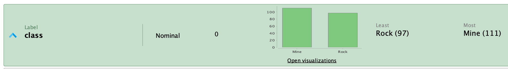
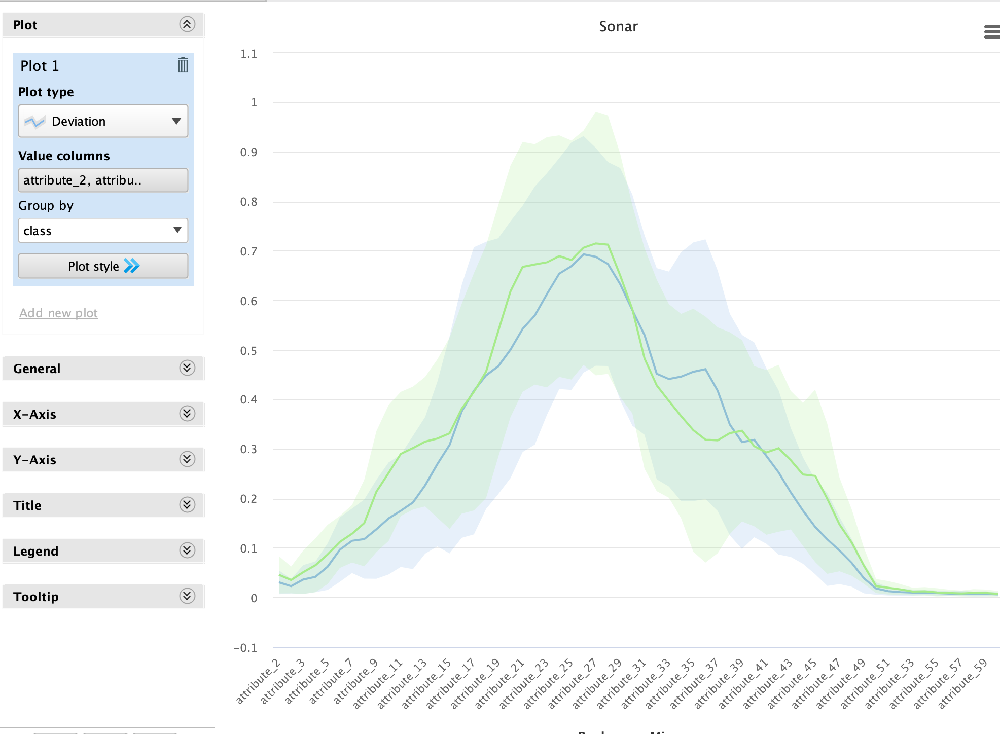
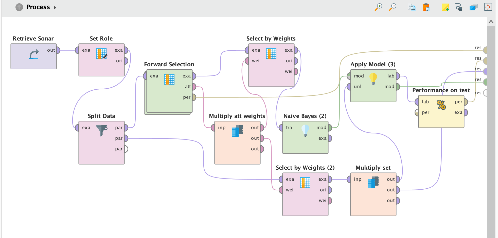
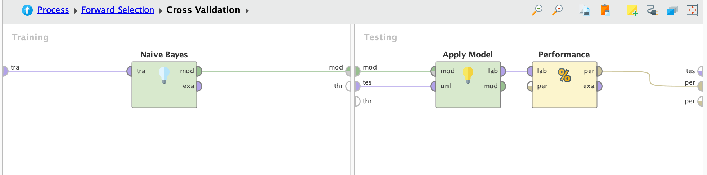
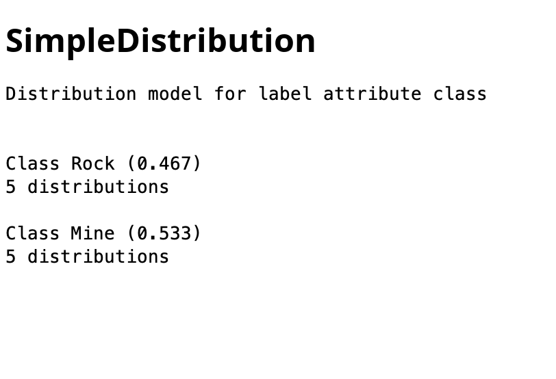
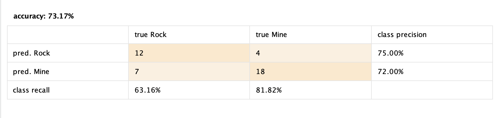
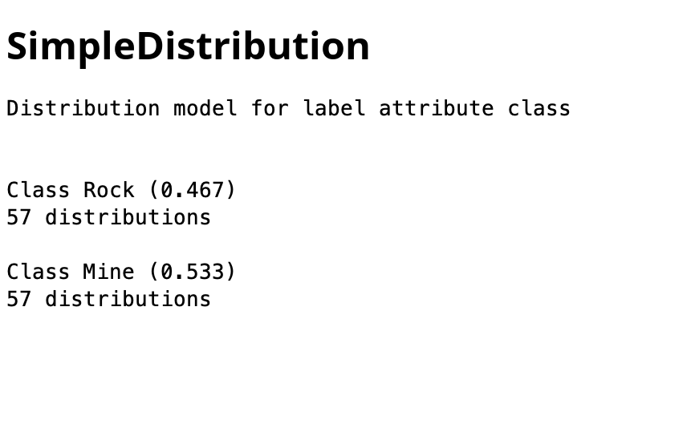
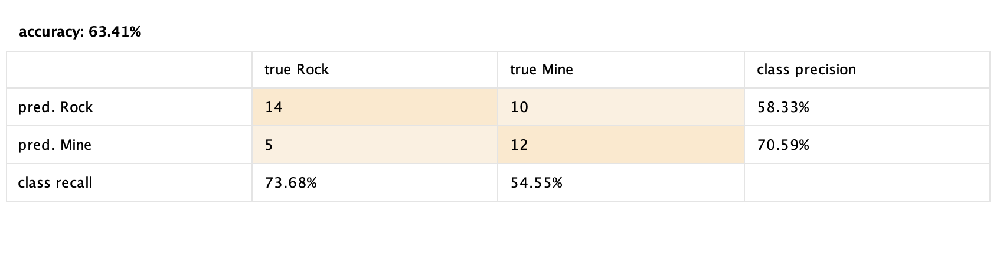

# Análisis del Dataset Sonar

## Descripción General

El dataset Sonar está compuesto por un total de **208 filas**, cada una de las cuales representa una muestra de un retorno de sonar.

## Características del Dataset

Cada fila del dataset contiene **60 características** (features) que describen las señales de sonar. La característica a predecir se denomina **"class"** y puede tener uno de dos valores: **"rock"** (roca) o **"mine"** (mina).

### Detalles de las Características

- Todas las características están normalizadas y varían entre **0.0 y 1.0**.
- Las características se denominan **attribute_1, attribute_2, ..., attribute_60**.

## Valores Faltantes

En el dataset no se presentan **valores faltantes** (missing values), lo que indica que cada muestra está completamente registrada y lista para ser utilizada en análisis y modelos de machine learning.

## Distribución de la Clase a Predecir

La distribución de la clase a predecir es:

## Tipo de Problema

Este es un **problema de clasificación**, ya que el objetivo es predecir la clase de cada muestra en función de las características dadas.

## Análisis de las Características

Al revisar el **deviation plot** (gráfico de desviación) de todas las características, podemos observar patrones que indican áreas en las que es posible identificar una clase u otra. Estos gráficos son útiles para visualizar la variabilidad y las tendencias de las características en relación con las clases, lo que puede proporcionar información valiosa para la selección de características y la interpretación de los modelos.

## Proceso de Selección de Características

Ahora, probaremos utilizar tanto **backward elimination** (eliminación hacia atrás) como **forward elimination** (eliminación hacia adelante) para seleccionar las características más relevantes del dataset. La eliminación hacia atrás comienza con todas las características y elimina las menos significativas una a una, mientras que la eliminación hacia adelante comienza con ninguna característica y añade las más significativas. Observaremos los resultados de cada enfoque para determinar cuál proporciona un mejor modelo predictivo.

### Diseño

El diseño será casi igual para ambas pruebas, solo cambiando el bloque de selection. Lo que se hace es un retrieve de la data, se setea la clase objetivo, y se separa la data en 80/20% train-test. Dentro del bloque de selection se tiene un cross-validation, conteniendo un modelo de naive-bayes. Del resultado de este, se toman los pesos para seleccionar los atributos y luego entrenar un modelo de bayes, el cual después predecirá sobre el apartado de test y así veremos la performance.

### Forward - Resultados

#### Distribuciones - F

Podemos ver que el algoritmo eligió solo 5 de las anteriores 60 features para predecir.

#### Performance sobre test - F

El modelo tiene una precisión del 73%, lo cual está bien, pero se podría mejorar. Podemos ver que predice mejor las minas que las rocas, siendo que el recall de las primeras es mucho más alto que las segundas.

### Backward - Resultados

#### Distribuciones - B

Cuando se utiliza backward elimination, resulta en 57 features para poder predecir. Esto implicaría un modelo mucho más grande que el anterior, y este aumento de complejidad puede ser algo problemático.

#### Performance sobre test - B

En cuanto a performance, el backward performó mucho peor que el forward. Menor precisión, y una recall que se invierte respecto al anterior, donde ahora predice mejor las rocas verdaderas que las minas verdaderas.

## Conclusión

A través de la aplicación de técnicas de selección de características, se observó que el modelo inicial logró identificar solo **5 de las 60 características** como relevantes para la predicción. Con una precisión del **73%** en el conjunto de prueba, el modelo demostró un rendimiento aceptable, aunque se identificó una desventaja en su capacidad para predecir rocas, ya que el **recall** para las minas fue significativamente más alto.

Por otro lado, al implementar **backward elimination**, se amplió el número de características seleccionadas a **57**, lo que resultó en un modelo considerablemente más complejo. Sin embargo, este aumento en la complejidad tuvo un efecto adverso en el rendimiento general. La precisión del modelo con backward elimination fue notablemente inferior al del modelo con forward elimination, mostrando que la capacidad para predecir minas disminuyó, mientras que la precisión para predecir rocas mejoró.

Estos resultados sugieren que, aunque la eliminación hacia atrás permite una mayor inclusión de características, no siempre resulta en un mejor rendimiento del modelo. En cambio, la eliminación hacia adelante parece ser más efectiva en este caso particular, al lograr una mejor combinación entre simplicidad y precisión en las predicciones. Esto resalta la importancia de elegir un enfoque adecuado de selección de características, ya que este puede influir significativamente en el rendimiento del modelo.
