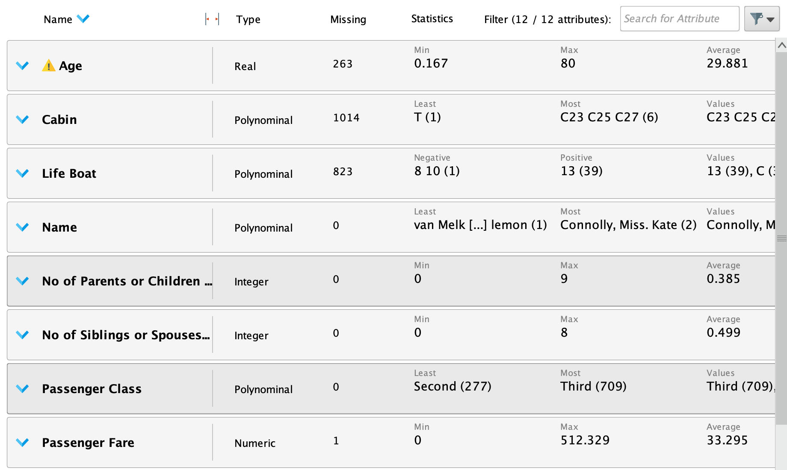
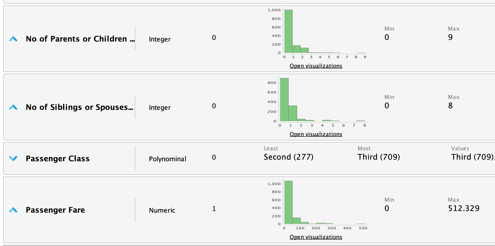
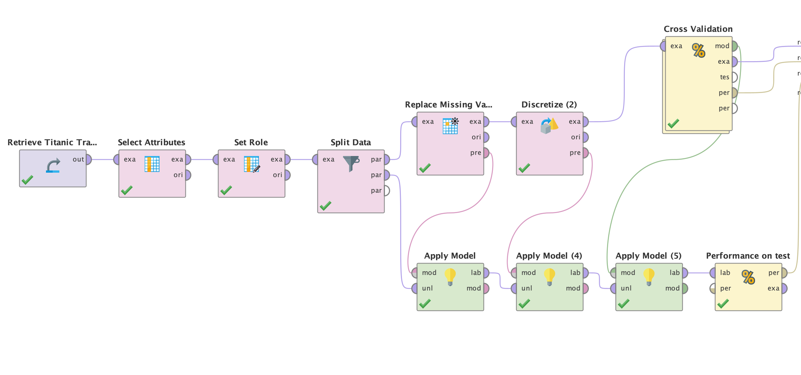

# Análisis Exploratorio de Datos (EDA) del Dataset del Titanic

## Descripción del Dataset

El dataset del Titanic contiene las siguientes características:

- **Passenger Class (Clase del pasajero)**: Categoriza a los pasajeros en tres clases (1ª, 2ª o 3ª clase).
- **Name (Nombre)**: Nombre del pasajero.
- **Sex (Sexo)**: Género del pasajero (Masculino o Femenino).
- **Age (Edad)**: Edad del pasajero.
- **No of Siblings or Spouses on Board (Número de hermanos o cónyuges a bordo)**: Número de familiares (hermanos o cónyuge) que acompañaban al pasajero.
- **No of Parents or Children on Board (Número de padres o hijos a bordo)**: Número de familiares (padres o hijos) que acompañaban al pasajero.
- **Ticket Number (Número de ticket)**: Identificador del billete del pasajero.
- **Passenger Fare (Tarifa del pasaje)**: El coste del pasaje.
- **Cabin (Cabina)**: Cabina asignada al pasajero.
- **Port of Embarkation (Puerto de embarque)**: Puerto donde el pasajero embarcó, representado como C (Cherburgo), Q (Queenstown) o S (Southampton).
- **Life Boat (Bote salvavidas)**: Número del bote salvavidas asignado al pasajero, si sobrevivió.
- **Survived (Sobrevivió)**: La variable objetivo (target) que indica si el pasajero sobrevivió al hundimiento, con dos posibles valores: **Yes** o **No**.

El objetivo de este análisis es predecir si un pasajero sobrevivió o no, por lo que estamos ante un problema de **clasificación**.

## Selección Inicial de Features

A primera vista, algunas de las características parecen no ser útiles para el problema de clasificación. Esto es debido a la naturaleza de los datos que almacenan y su poca relación directa con la supervivencia. Las características que inicialmente se consideran menos relevantes son:

- **Name (Nombre)**: No aporta información directa que ayude a predecir la supervivencia.
- **Ticket Number (Número de ticket)**: Similar al nombre, probablemente no influya en la probabilidad de supervivencia.
- **Port of Embarkation (Puerto de embarque)**: No parece tener una relación fuerte con la supervivencia.
- **Cabin (Cabina)**: Muchos valores faltantes y podría no influir en el resultado final.
- **Life Boat (Bote salvavidas)**: Esta variable no debería ser usada, siendo que es algo post suceso, se hunde el titanic a la vez que la gente se sube a los botes / se sube luego de hundido. No son datos que tendríamos al momento de inferir si fuese antes del suceso.

Estas variables pueden ser eliminadas en un análisis más profundo, aunque podría ser interesante de igual manera probar utilizarlas al momento del modelado, y ver si hay algo que se nos pasó como información que brindan, en este análisis previo.

## Análisis de Valores Faltantes

Una parte clave del análisis exploratorio es revisar la cantidad de valores faltantes. Al analizar el dataset, se puede observar que solo una característica tiene una cantidad significativa de datos nulos:

1. **Cabin (Cabina)**: La mayoría de los valores están vacíos, lo que sugiere que esta columna contiene demasiada información ausente y puede ser descartada o tratada de otra manera.

El resto de las características tienen una cantidad baja de valores faltantes, por lo que no debería representar un problema grave para el análisis, solo deberá afrontarse al momento de modelado el qué hacer con estos faltantes.

## Matriz de Correlación

Para entender cómo se relacionan las características entre sí y con la variable objetivo `Survived`, se genera la matriz de correlación. Esta matriz muestra qué tan fuertemente relacionadas están las variables numéricas.

- No se observa una correlación significativa entre la mayoría de las características y la supervivencia. Sin embargo, se destaca una leve correlación entre `Sexo (Género)` y `Survived (Sobrevivió)`.
- Esto sugiere que el género puede ser un factor importante en la predicción, y que posiblemente está relacionado con otras características de la situación, por ejemplo, que se priorizase el abordaje de las mujeres sobre el de los hombres a los botes salvavidas.

Esta pista inicial puede ayudarnos a refinar el modelo y explorar más a fondo cómo las combinaciones de variables y su efecto en el modelo.

## Distribuciones

Para las variables númericas:

- Exceptuando `Age`, las demás tienden a estar muy *skew* hacia la izquierda, acumulandose la gran mayroía de los datos sobre un extremo.
- `Age` se encuentra en una distribución bastante parecida a la normal, con un pequeño salto.
- Podría ser una buena idea transformar esas features para que tengan una distribución más normal, lo cual sería necesario para modelos como linear regression, etc.

- De las binomiales, podemos ver una tendencia tanto a que la gente no sobreviva, siendo esto un caso más probable que sí, y una tendencia a que el pasajero sea hombre.

## Preparación de Datos y Elección del Modelo

### Pasos Iniciales de Preprocesamiento

1. **Eliminación de la columna `Passenger Fare`**:
   Primero, he decidido eliminar la columna `Passenger Fare` del dataset. Esta característica, aunque numérica, no parece ser un buen predictor de la supervivencia, ya que no tiene una correlación fuerte con la variable objetivo y podría añadir ruido al modelo.

2. **Imputación de valores faltantes en `Age`**:
   La columna `Age` contiene algunos valores faltantes, por lo que he optado por imputar el valor promedio de la edad en los casos donde los datos están ausentes. Esto ayuda a evitar la eliminación de filas, lo que podría reducir la cantidad de datos disponibles para el entrenamiento del modelo.

3. **Discretización de `Age` en 10 bins**:
   Luego de imputar los valores faltantes, he decidido discretizar la columna `Age` en 10 rangos o "bins". Esto convierte la variable continua en una categórica, lo cual es útil para ciertos modelos, como el de Naive Bayes.

### Elección del Modelo: Naive Bayes

He elegido **Naive Bayes** porque es un modelo simple y rápido, ideal para este tipo de problemas de clasificación. Funciona bien con datos categóricos, como muchos de los que se presentan en este dataset.

Este modelo será utilizado sobre un `cross-validation`, para encontrar el mejor modelo a través de los distintos *folds*.

## Rapidminer

Aquí podemos ver el proceso completo con los pasos antes descriptos, y así también se puede ver la separación de los datos para prevenir un *data leakage*, separando en train y test, 80/20 respectivamente.

## Resultados

### Performance en train

### Conclusiones del Rendimiento del Modelo

1. **Precisión General**: El modelo tiene una precisión de 79.68%, lo que significa que el 80% de las predicciones fueron correctas.

2. **Desempeño por Clase**:
   - **Sobrevivió**:
     - **Precisión**: 75.79%
     - **Recall**: 68.46%
   - **No Sobrevivió**:
     - **Precisión**: 81.70%
     - **Recall**: 86.56%

3. **Observaciones**:
   - El modelo es mejor prediciendo quién **no sobrevivió** que quién **sí sobrevivió**, ya que el recall es más alto para la clase "No".
   - Podría mejorar en la predicción de la clase "Yes".

El modelo es preciso, pero tiene más dificultades para predecir correctamente a los sobrevivientes.

### Performance en test

## Conclusiones del Rendimiento del Modelo en Test

1. **Precisión General**: El modelo tiene una precisión de 80.33%, lo que indica que alrededor del 80% de las predicciones en el conjunto de test fueron correctas.

2. **Desempeño por Clase**:
   - **Sobrevivió**:
     - **Precisión**: 75.76%
     - **Recall**: 71.43%
   - **No Sobrevivió**:
     - **Precisión**: 82.91%
     - **Recall**: 85.84%

3. **Observaciones**:
   - El modelo sigue siendo más eficaz en predecir quién **no sobrevivió**, con una mayor precisión y recall en comparación con la clase "Yes".
   - El **recall** de la clase "Yes" (71.43%) ha mejorado en comparación con el conjunto de entrenamiento, pero sigue siendo inferior al de la clase "No".

El rendimiento del modelo en el conjunto de test es similar al del conjunto de entrenamiento, con un buen balance de precisión, aunque el modelo sigue siendo más preciso prediciendo quién no sobrevivió.
